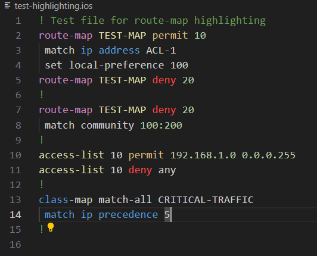

# vscode-cisco-syntax

Cisco IOS Highlighting for [Visual Studio Code](https://code.visualstudio.com/)

## What This Extension Does

This extension provides comprehensive syntax highlighting for Cisco IOS, IOS-XE, NX-OS, and ASA configuration files. It enhances your network automation and configuration management workflow by:

- **Color-coded syntax highlighting** for Cisco commands, keywords, and parameters
- **Improved readability** of configuration files with proper formatting
- **Support for multiple file types** including `.ios`, `.cfg`, and `.conf` extensions
- **Enhanced development experience** when working with network device configurations
- **Better error detection** through visual highlighting of malformed commands
- **Duplicate sequence detection** with hover tooltips for route-maps and access-lists

Perfect for network engineers, DevOps professionals, and anyone working with Cisco network device configurations in VS Code.

## Preview



## Quick Start

* Install the [extension](https://marketplace.visualstudio.com/items?itemName=dericklawson.cisco-ios-highlighter) with VSCode.

* Save a file with the `.ios` extension and open with VSCode

## New Features

### Duplicate Sequence Detection

The extension now provides intelligent hover tooltips to detect duplicate sequence numbers in:

- **Route-maps**: Hover over any route-map line to see if the same sequence number is used elsewhere
- **Access-lists**: Hover over access-list entries to detect duplicate sequence numbers within the same ACL

Example duplicate scenarios detected:
```cisco
route-map TEST-MAP permit 10
 match ip address ACL-1
route-map TEST-MAP deny 20
 match all
route-map TEST-MAP deny 20    ← Duplicate sequence 20 detected
 match community 100:200

ip access-list standard 2
 10 permit 172.22.1.1
 20 permit 10.1.1.1
 20 permit 12.1.1.1          ← Duplicate sequence 20 detected
```

When you hover over a duplicate line, you'll see a warning tooltip indicating the duplicate and showing which other lines contain the same sequence number.

## Links

[GitHub](https://github.com/woodjme/vscode-cisco-syntax)

[Visual Studio Marketplace](https://marketplace.visualstudio.com/items?itemName=dericklawson.cisco-ios-highlighter)
